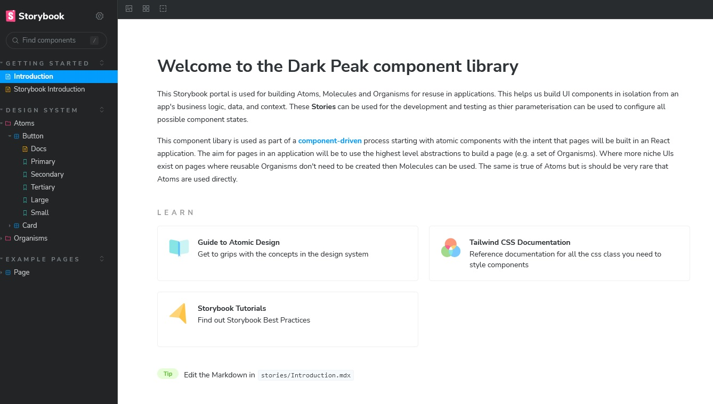

# darkpeak-component-library

A React component library for Dark Peak Development which uses an atomic design system.

To start contributing `npm run storybook` in your terminal.

This will launch the following portal:

